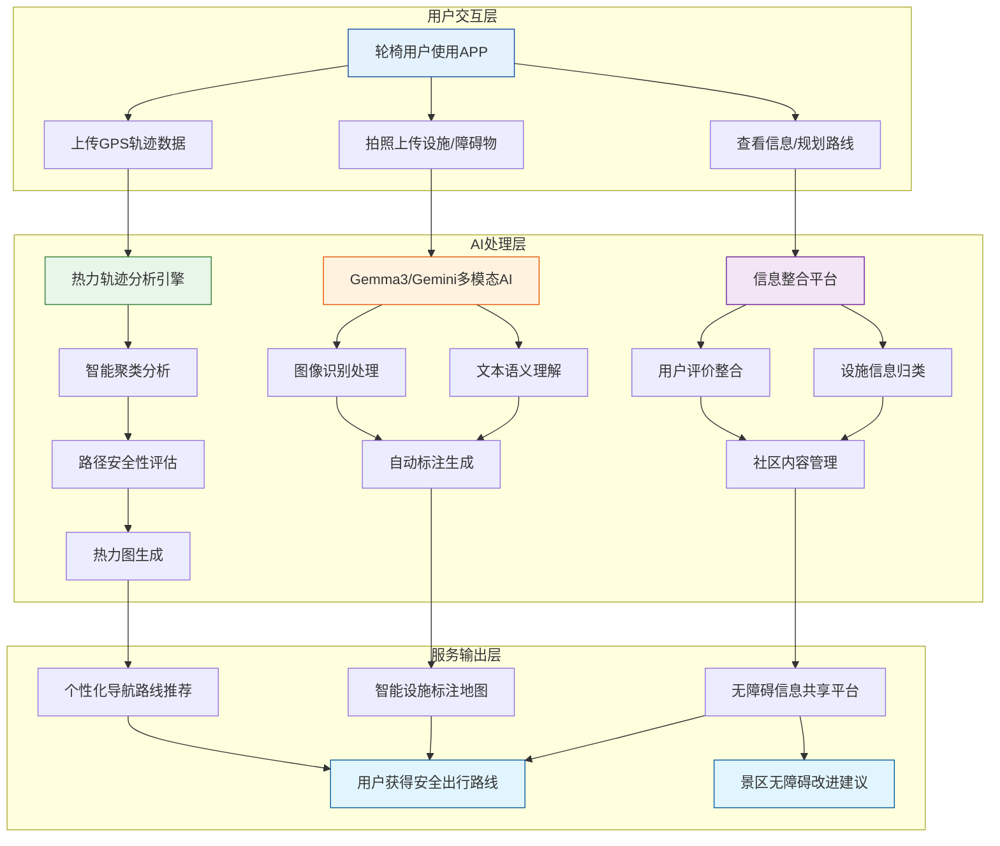

# 智慧景区无障碍 AI 助手

## 项目概述

智慧景区无障碍 AI 助手是一个面向无障碍人群的智能助手和信息平台。项目基于真实用户轨迹数据进行智能聚类分析，实现无障碍路线热力图。利用 Google Gemma3 多模态能力批量分析用户反馈的图文数据，实现地图更新。同时项目致力于构建景区无障碍社区，实现无障碍信息的共享和互助。

## 技术说明

Google Vertex AI（Gemini 大模型）承担了图片+文本的多模态智能识别、无障碍信息抽取、评论摘要等核心智能分析任务，是项目智能化的关键。备注：Vertex AI暂不支持Gemma3模型，所以本项目使用Gemini模型临时替代，后续会使用Gemma3模型。

## 技术架构与流程图

---

## 主要功能说明

- **无障碍信息识别**：用户上传图片和评论，系统自动识别无障碍类型及潜在问题。
- **智能摘要与查询**：对无障碍点的用户评论进行智能摘要，辅助用户查询。
- **训练与测试**：支持自定义 prompt 和图片进行 AI 能力测试。

---

## Google AI 作用与路径

- **核心作用**：Google Vertex AI（Gemini大模型）负责多模态智能识别、信息抽取、评论摘要等。
- **调用路径**：
  - Service 层（如 UpdateFeedBackService、SearchPointService、TrainingService）通过 GoogleCloudVertexAIServiceFacade 统一调用 Vertex AI。
  - GoogleCloudVertexAIServiceFacade 负责数据预处理、模型调用、结果解析。
  - GoogleVertexAIClientFactory 负责模型实例化、认证、代理等底层细节。

---

